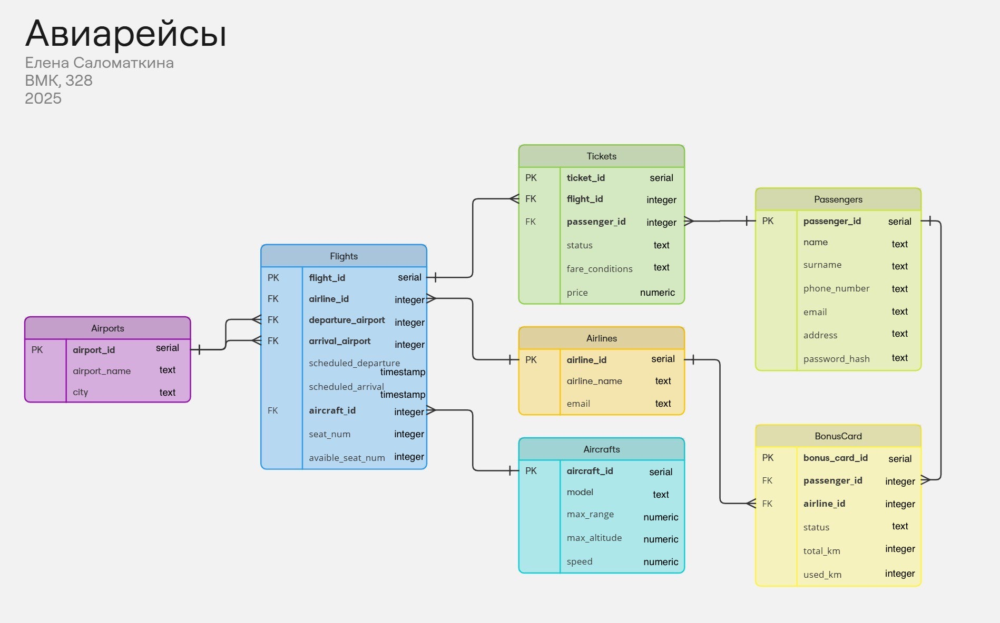
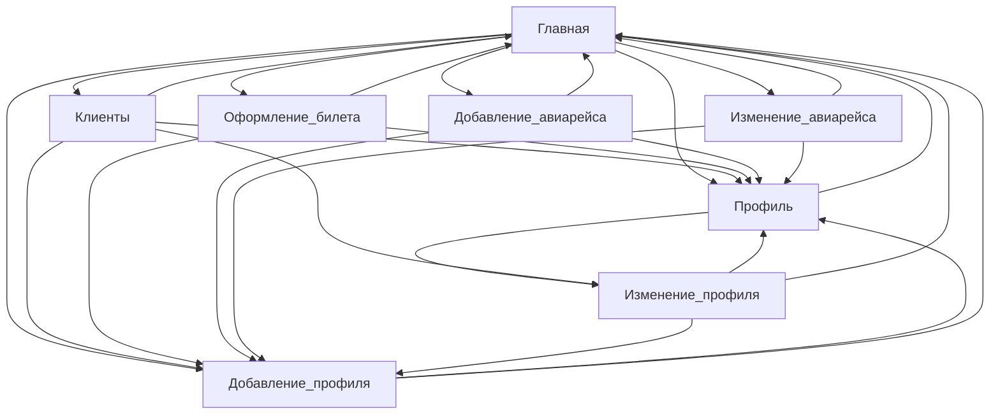

# Вариант задания: Система информации об авиарейсах и билетах

1. Поддерживаемые данные
    - Авиарейсы
        - Компания, номер
        - Аэропорты вылета и прилета
        - Время и даты вылета и прилета
        - Стоимость билетов
        - Количество мест и наличие свободных мест
    - Клиенты
        - ФИО
        - Контактная информация: адрес, телефон, e-mail
        - Заказанные билеты, оплаченные билеты
        - Наличие бонусных карт авиакомпаний
        - Налетанные километры по каждой авиакомпании, использование для оплаты других билетов
2. Поддерживаемые операции
    - Получение списка авиарейсов по датам и направлениям, информации о ценах билетов и наличии свободных мест
    - Получение списка клиентов, в т.ч. летавших определенным рейсом, любыми рейсами авиакомпании, заказавших и оплативших билеты
    - Получение истории заказов клиента, информации о его бонусах и их использовании
    - Заказ и оплата билетов на выбранный рейс
    - Добавление и удаление рейса, чтение и редактирование данных о нем
    - Добавление и удаление клиента, чтение и редактирование данных о нем

## Схема базы данных

## Схема Страниц

На каждой странице сверху размещено навигационное меню с кнопками перехода:
1. на Главную
2. в Профиль
3. к Регистрации
4. к списку Клиентов

## Главная страница

На ней размещены:
1. Список всех активных авиарейсов и данные о них
  - Аэропорт и город отбытия
  - Аэропорт и город прибытия
  - Авиакомпания
  - Количество оставшихся мест
  - Дата и время отлета
  - Дата и время прилета
2. У каждого элемента списка кнопка Удалить 
3. У каждого элемента списка кнопка Редактировать (переход на страницу Изменение авиарейса)
4. Кнопка Добавить авиарейс (переход на страницу Добавление авиарейса)
5. У каждого элемента списка кнопка Оформление билета (переход на страницу Оформление билета)
6. Поисковая строка (несколько полей: город прилета, город вылета, дата вылета, класс обслуживания)
7. Кнопка Поиск (для отображения только подходящих рейсов)
    

## Изменение авиарейса

На странице есть возможность изменить следующие данные об авиарейсе:
  1. авиакомпания
  2. аэропорт отбытия
  3. аэропорт прибытия
  4. дата и время отбытия
  5. дата и время прибытия
  6. самолет
  7. общее количество мест
  8. количество свободных мест
     
После изменяемых полей кнопка Изменить

## Добавление авиарейса

На странице есть возможность добавить авиарейс со следующими данными:
  1. авиакомпания
  2. аэропорт отбытия
  3. аэропорт прибытия
  4. дата и время отбытия
  5. дата и время прибытия
  6. самолет
  7. общее количество мест
  8. количество свободных мест

После добавляемых полей кнопка Добавить

## Оформление билета

На странице размещена полная информация об авиарейсе, включая цену на билеты.
Есть возможность оформить билет на авиарейс:
 1. Выбор класса обслуживания
 2. Выбор конкретного места
 3. Ввод номера бонусной карты при наличии (после ввода - возможность указать, сколько баллов использовать)
 4. Отображение цены с учетом использованных баллов
    
После кнопка Оформить
 
## Профиль 

На странице размещены:
1. Данные (ФИО, email, телефон)
2. История заказов (данные о всех завершенных авиарейсах, на которые был оплачен билет данным пользователем) с указанием аэропорта вылета, аэропорта прилета, даты и времени вылета, прилета, цены на билет
3. Список купленных билетов (те же данные, что и в истории заказов, но для билетов на еще не завершенные рейсы), для каждого элемента списка кнопка Отменить, Оплатить
4. Список бонусных карт и информация о бонусах с указанием авиакомпании, которой принадлежит данная карта, статуса карты (активна/не активна) + общее и использованное количество километров
5. Кнопка Редактировать профиль  (переход на страницу Изменение профиля)
6. Кнопка Удалить профиль

## Добавление профиля

На странице есть возможность добавить пользователя. В форме указываются следующие данные:
1. ФИО
2. email
3. телефон
4. пароль
   
После кнопка Регистрация

## Изменение профиля

На странице есть возможность изменить данные пользователя:
1. ФИО 
2. email 
3. телефон
   
После кнопка Редактировать

## Клиенты 

На странице размещены:
1. Список всех зарегистрированных пользователей и данные о них (ФИО, email, телефон) (на имя пользователя можно нажать и перейти в его профиль)
2. Поисковая строка (несколько полей: указание номера рейса, авиакомпании, статуса билета)
3. Кнопка Поиск для отображения списка клиентов, летавших определенным рейсом, подходящих под фильтры
2. У каждого элемента списка кнопка Удалить 
3. У каждого элемента списка кнопка Редактировать  (переход на страницу Изменение профиля)

## Сценарии использования

- Получение списка авиарейсов по определенным направлениям/датам, информации о наличии свободных мест 
  - Перейти на Главную
  - Ввести определенную дату, город вылета, город прилета, класс обслуживания
  - Нажать кнопку Поиск
 
- Получение информации о ценах билетов на авиарейс
  - Перейти на Главную
  - Нажать кнопку Оформление билета 

- Получение списка клиентов, летавщих определенным рейсом/рейсами определенной авиакомпании
  - Перейти на страницу Клиенты
  - Ввести определенный номер рейса/название авиакомпании
  - Нажать кнопку Поиск

- Получение истории заказов пользователя
  - перейти в Профиль
 
  - перейти в Клиенты
  - Нажать на имя пользователя (переход в Профиль)

- Оформление билетов на авиарейс
  - Перейти на Главную
  - Нажать кнопку Оформление билета
  - Ввести необходимые данные
  - Нажать кнопку Оформить
 
- Оплата билетов на авиарейс
  - Перейти в Профиль
  - Нажать кнопку Оплатить 

- Добавление и удаление рейса, чтение и редактирование данных о нем
  - Перейти на Главную
  - Нажать кнопку Редактировать/Удалить/Добавить авиарейс 
  - Если выбрано редактирование, ввести необходимые данные, нажать кнопку Редактировать
  - Если выбрано добавление авиарейса, ввести необходимые данные, нажать кнопку Добавить

- Добавление клиента
  - Перейти на страницу Регистрация
  - Ввести данные
  - Нажать кнопку Регистрация
 
- Удаление клиента, чтение и редактирование данных о нем
  - Перейти на страницу Клиенты
  - Нажать кнопку Редактировать или Удалить
  - При выборе редактирования, ввести необходимую информацию, нажать кнопку Редактировать
